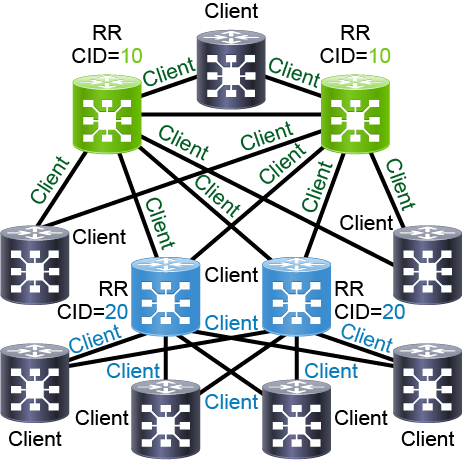

# Scaling BGP

## Route Reflectors and BGP Confederation Overview

- The classic iBGP split horizon rule is that updates are received on a EBGP session should be forwarded on all iBGP and EBGP sessions, but updates that are received on an iBGP session should only be forwarded on EBGP sessions.
- The primary reason is to avoid routing loops, and it mandates the configuration of full mesh for iBGP neighbors inside an AS -- (n*(n-1))/2 or 24 routers = (24*(24-1))/2 = 276 sessions to configure. 
- Each iBGP session is a TCP session to another iBGP peer, and updates sent to all iBGP peers could result in a significant amount of control plane TCP traffic

## Scalable iBGP solutions

There are two solutions:

1. Route reflectors -- these modify the split horizon rule, and they become a sort of "BGP concentrator"
2. BGP confederations -- introduce the concept of various smaller AS's within the original AS, and the smaller AS's mainain intra-confederation EBGP sessions

### Design guidelines
- Route reflectors 
    - are generally preferred by operators
    - **Usage**: when there are more than 5 iBGP-speakers, which means practically the only except are multihomed enterprise networks with 1-3 edge routers
    - **Primary purpose**: to reduce iBGP complexity and optimize performance
    - **Net effect**: RR modify split-horizon rule to workaround full-mesh

- BGP confederations
    - **Usage**: when a very large network consists of multiple administrative domains with differing route policies
    - **Primary purpose**: to split a large network into smaller pieces to apply inbound and outbound policies at intra-confederation EBGP boundaries
    - **Net effect**: BGP confederations modify iBGP AS-path processing 

## BGP Split-Horizon Rule and Other Loop-prevention Mechanisms

- The classic iBGP split horizon rule is that updates are received on a EBGP session should be forwarded on all iBGP and EBGP sessions, but updates that are received on an iBGP session should only be forwarded on EBGP sessions.

- For EBGP, AS Path is checked for the presence of the local AS to prevent routes from being re-injected


### Modified split-horizon for Route Reflectors

- Normal EBGP processing rules, routes from EBGP sessions are forwarded to any neighbor
- Routes from normal iBGP neighbors are sent to all iBGP clients and all EBGP peers.
    - **NOTE**: the default split-horizon rules apply to normal iBGP neighbors, but for iBGP clients of the RR, routes from iBGP neighbors are forwarded to iBGP clients
- Routes from iBGP clients are sent to any neighbor to ensure that all other routes receive updates from clients who are *assumed* to not have any other iBGP neighborships apart from with the iBGP RR

### BGP Loop Prevention with RR-Cluster ID

- Redundant RR can form a route reflector cluster. A BGP cluster ID (CID) is used to identify RR that form a cluster. 
- The CID is used for loop prevent-- when a route is reflected, the RR creates the BGP Cluster List attribute if it does not exist and adds or appends it's own CID to the list.
    - If a route is received by a RR in the same cluster, it will block it similiar to AS Path loop prevention b/c the RR sees its own CID.

- The route reflector does not change the next-hop attribute or any common BGP attributes. 

- Additionally, when a route is reflected, the RR sets the originator-ID BGP attribute to the router ID of the peer from which it received the route. Any router that receives a route with its own router ID in the originator-ID attribute silently ignores it.

- BGP best-path selection has some rules to include RR-related criteria. These tend to be low on the list, below preferring EBGP paths over iBGP paths
    - When a router receives 2 iBGP paths, the nonreflected routes (with no Originator-ID) are preferred over reflected routes
    - When a comparing reflected routes that are the same, shorter cluster lists are preferred

## More on BGP RR's

- Used to relay iBGP topology requirements
- All of the RR configuration is only done on RR
    - Configure which iBGP neighbors are clients
    - Configure cluster ID if redundant
    - Clients have normal iBGP neighbor config with RR
    - RR are implemented on on per address family basis 

### Hierarchical BGP RR's

A network designer can use hierarchies for one RR cluster to act as a client in another cluster.





Clients of top RR cluster can be RR for lower level clients
- Very useful in very large networks where one level of RR 
- Each RR has its own unique cluster ID
- Lower-level RR do not require a iBGP session between each other

### Configuring RR

``` py title="IOS XE"
router# conf t
router(config)# router bgp 64497
router(config-router)# bgp cluster-id 10
router(config-router)# address-family ipv4 unicast
router(config-router)# neighbor 203.0.133.41 router-reflector-client
```

``` py title="IOS XR"
router# conf t
router(config)# router bgp 64497
router(config-bgp)# bgp cluster-id 10
router(config-bgp)# neighbor 203.0.133.41
router(config-bgp-nbr)# address-family ipv4 unitcast
router(config-bgp-nbr-af)# router-reflector-client
```

- Verifying RR neighbor status 
    - On both IOS XE/XR, in the `show bgp ipv4 neighbor` commands, there are lines indicating `Route-Reflector Client`
    - When looking at BGP routes, you can see `Originator:` and `Cluster life:` fields 

### RR Guidelines 

When configuring RR, you must ensure the iBGP sessions between (if hierarchical) RR are configured properly, and that RR client sessions to iBGP clients are configured properly. Clients should should not sessions with other clients.

Basically, do not misconfigure things. If hierarchical, you must ensure top-level RR cluster are peering with each other in iBGP full mesh. 

## BGP Confederations

BGP confederations can be used to split a network into smaller networks where in/outbound policies or filters be be applied on intra-confederation EBGP boundaries. 

Commonly used to split very large networks along administrative boundaries. 

- Each router must be aware of its real AS number to distinguish between external and intra-confederation EBGP sessions
- Intra-confederation EBGP sessions behave almost like iBGP:
    - Local preference, Next-hop, MED attributes are unchanged
    - Only AS path attribute is modified with internal AS numbers
    - Internal AS numbers are removed on external EBGP sessions

- Within the member AS or sub-AS's, iBGP rules still apply. So there must be full-mesh iBGP or RR's. 

``` py title="IOS XE"
router# conf t
router(config)# router bgp 65002
router(config-router)# bgp confederation identifier 64998
router(config-router)# bgp confederation peers 65001 65002 65003
```

- The real AS number is 64998, while the intra-confederation AS number is 65002 above.

``` py title="IOS XR"
router# conf t
router(config)# router bgp 65001
router(config-bgp)# bgp confederation identifier 64498
router(config-bgp)# bgp confederation peers
router(config-bgp-confed-peers)# 65001
router(config-bgp-confed-peers)# 65002
router(config-bgp-confed-peers)# 65003
```

When doing `show bgp ipv4 unicast 204.12.13.103` on IOS-XE, sub-AS numbers will be in parathenthis with a note about `confed-external`

On IOX-XR, `show bgp neighbor` will display `external link` + `neighbor under common admin`. These tell you it is an EBGP intra-confederation neighborship.