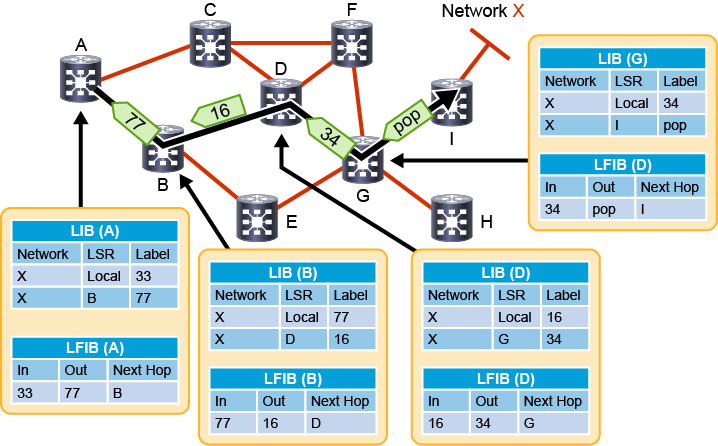
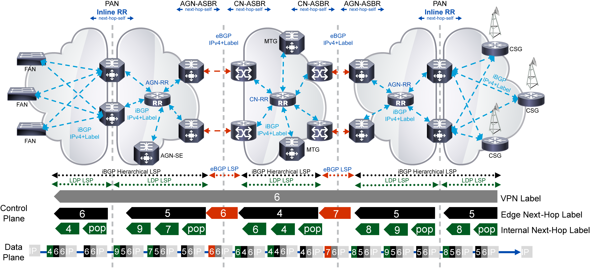

# Implementing and Verifying MPLS

## MPLS Forwarding Structures

MPLS adds two functions to an IP network: Label Distribution Protocol (LDP) to exchange labels between routers and a Label Forwarding Information Base (LFIB) to enable routers to forward packets based on their labels in received packets. 

Similiar to how OSPF -> RIB -> FIB, there is LDP -> LIB -> LFIB.

However, for MPLS to work well, you'll need the whole "SP" stack, with an IGP and BGP to built the control plane

Some control plane functions within MPLS:

- Either IS-IS or OSPF are used to provide reachability within the AS. 
- BGP is used to carry all other routes, such as customer or Internet routing info. MP-BGP can also carry info for non-IP solutions or implement VPN's
- LDP is used to exchange labels for routes learned via the IGP, which enables all destinations in the AS to be reachable with a label switched path (LSP). A LSP is built for every destination based on IGP determined path.
- Resource Reservation Protocol (RSVP) is used with MPLS TE to build LSPs that may diverge from the IGP-determined shortest path in order to improve utilization (reduce congestion) or provide QoS for diff types of traffic.

Some data plane functions within MPLS:

- Based on the contents of the **FIB** for a route lookup, a router will perform two different *forwarding* functions:
    1. **Ingress Edge Label Switched Router (LSR)**-- if the route in the FIB has a stack of labels associated with it, the packet will be sent as a labeled packet
    2. If the route has no label, the router will perform normal IP forwarding 

- A router makes label forwarding decisions based on the top label in the stack between the L2 and L3 headers. This is the **LFIB**, and based on the contents of the matching route, a router will do:
    1. **Core LSR**: if the top label is mapped to a next-hop label, the router will replace the top label and the labeled packet will be forwarded
    2. **Egress edge LSR**: upon examination of the top level label, if there is no next-hop label, the router will remove the label and (optionally) perform an IP lookup and forward the IP packet

### Label Distribution Protocol

LDP is responsible for populating labels or the forwarding structures used by MPLS.

FIB == destination networks, next-hops, outgoing interfaces, and L2 pointers is populated from the RIB and ARP cache. The RIB is populated by routing protocols.

Also, the MPLS label is added to destination networks if outgoing interface is enabled for MPLS and a label has been *received from* the next-hop router. LDP adds the label to FIB entries, creating the LFIB with locally assigned (incoming) and received from next-hop (outgoing) labels. 

### Label switched path

An LSP is a sequence of Label Switched Routers (LSR) that forward labeled packets for a specific Forwarding Equivalence Path (FEC). Each intermediate LSR along the path swaps label along the LSP.

A FEC is a group of packets that are forwarded along the same path and get the same forwarding treatment.

So in MPLS unicast forwarding, the FEC's are deteremined by destination networks found in main routing table, and a LSP is created for each entry. 

There is an **exception** for BGP-derived routes. There is a shared label for all BGP routes that share the same next-hop address. All of the core (P) routers run an IGP to learn BGP next-hops. So an IGP populates the routing table in all MPLS routers, then LDP propagates labels for these IGP learned networks to build LSPs.


- LSP's are unidirectional. 
- They are built using: (1) IGP to determine shortest path, (2) LDP to allocate and exchange labels




### Label Allocation and Distribution

1. IP routing protocols build the IP routing table
2. Each LSR assigns a label (local labels) to every destination in the RIB except for BGP-learned routes for which the label for the next-hop is reused
3. LSRs announce their assigned labels to all other LSRs
4. Every LSR builds its LIB, LFIB, and FIB data structures based on received labels and chosen best paths

MPLS uses a liberal label retention mode, which means it will keep labels received LDP peers, even if they are not received from LDP peers even if they are not actively used.

The LSR's stores labels and related information inside the LIB. This is the control plane for LDP. A route prefix is assigned a locally significant label, which is mapped to a next-hop label learned from downstream neighbor.

The LFIB contains local labels (which are advertised to upstream neighbors) mapped to next-hop labels, which are received from downstream neighbors. 

MPLS routers locally allocate labels, independently and asynchronously. 

On the edge LSR, next-hops outside the MPLS domain are not assigned a label. Instead, the `pop` or implicit null label is advertised, which instructs the penultimate router to remove the label when forwarding packets to the egress router. This is the penultimate-hop popping (php).

**Label advertisement**:

[`A` Edge LSR] - [`B` LSR ] - [`C` LSR ] -- [`D` Edge LSR]- (network 12.0.0.0/8)


1. Router `B` allocates label 25 for network 12.0.0.0/8. The label is stored in `B` LIB. It is stored as an incoming label in the LFIB. There is no outgoing label for network 12.0.0.0/8 from next-hop router `C`. Label 25 is advertised to neighbors `A` and `C`, regardless of whether or not the neighbor is a next-hop for a destination.

2. Router `A` allocates label 21 for network 12.0.0.0/8. Label 21 is stored in the LIB and LFIB as incoming label, while label 25 is stored as outgoing label in LFIB and FIB. 

3. Router `C` allocates label 34 for network 12.0.0.0/8. It is stored in the LIB and LFIB as incoming label, then advertised to `B` and `D`. Router `C` also receives a label for 12.0.0.0/8 from router `B`, even though it is not the next-hop and stores it in the LIB.

4. Router `B` gets label 34 from `B` for network 12.0.0.0/8 and stores it in the LIB. Label 34 is the next-hop for destination 12.0.0.0/8, so it is also stored in LFIB as outgoing label. Router `B` also sets label 34 for 12.0.0.0/8 in FIB b/c this label is from the next-hop.

5. Then on router `D`, it allocates implicit null for network 12.0.0.0/8, as it is outside the MPLS domain. This implicit null label is also advertised to router `C` to perform label removal (pop) operation.

6. Router `C` receives this implicit null label from `D` and stores it in LIB. This is from the next-hop for 12.0.0.0/8, router `C` also stores the implicit null label in LFIB as outgoing label. The label for 12.0.0.0/8 to `D` is also stored in the FIB on router `C`.

The LSP for 12.0.0.0/8 through A->B->C->D is established. 

So for **packet propagation** through this LSP, it works like:

1. Router `A` receives packet destinationed to 12.0.0.0/8. FIB lookup resolves to label 25, which is switched via CEF.

2. Router `B` receives a packet with a label 25, so LFIB lookup maps incoming label 25 to outgoing label 34 with next-hop router `C`. This is label-switched via LFIB.

3. Router `C` receives a packet with label 34. LFIB maps incoming label 34 to outgoing implicit null to next-hop router `D`. Router `C` pops the label and forwards the packet to router `D` by label-switching via LFIB.

4. Router `D` performs an IP lookup in FIB table to forward packet to destination 12.0.0.0/8.


The PHP or pop with implicit null is the default behavior on Cisco MPLS-enabled routers. If you use `explicit null`, then there is an additional LFIB lookup on router `D`. Starting from step 3 above where router `D` advertised label 47 for 12.0.0.0/8.

3. Router `C` receives a packet with label 34. LFIB maps incoming label 34 to outgoing label 47 with next-hop router `D`. This is label-switched via LFIB.

4. Router `D` receives packet with lavel 47. LFIB lookup maps incoming label 47 to pop to remove the label, then a FIB lookup for an IP lookup to forward packet to destination 12.0.0.0/8 occurs.


### The MPLS Steady State condition

**Steady State* is when all labels are exchanged and the LIB, LFIB, and FIB structures are completely populated. 

- It takes longer for LDP to exchange labels compared to routing protocol convergence
- There is no network downtime while LDP exchanges labels since packets can route using the FIB and IP lookups
- Then once steady state is reached, all packets are label-switched (faster, cheaper), except on ingress and egress edge LSR.

### MPLS label control methods

This is label filtering in LDP. There is incoming and outgoing filtering.

1. Outgoing is known as Label Advertisement Control or outbound label filtering. 
2. Incoming is known as Label Acceptable Control or inbound label filtering.

Both of these are used to improve scabability and memory-usage or security reasons. 

Inbound label filtering potentially overrides the default behavior to keep remote label binding from all LDP peers for a given prefix, even if the LDP peer is not the next-hop.

### Gotchas with route summarization, aggregation

You can have route information for a /24 and then an aggregate /16. MPLS will build LSP's for both routes, and depending on where the summarization boundary is, this can result in an early pop then re-labeling on the next-hop router.

This should not be an "issue" for the router at the summarization boundary has more specific routes, but if this router does not (like a P router that likely won't have full tables for IP transit or if it has services like MPLS-based VPNs), then these services will fail due to missing routing info or info on the second-layer of MPLS labels. 

So, IGP summarization likely should not be used where:

- MPLS VPNs
- MPLS TE
- Transit BGP where core routers are not running BGP

## MPLS Forwarding Operations 

Let's look at the forwarding specifics now...

For review, MPLS adds functionality to the normal IP forwarding by:

- LDP in control plane to allocate and exchange labels
- LFIB is used to forward labeled packets
- FIB table labels IP packets if the next-hop has a label assigned to it

By default, **IP forwarding** without labels works like:

A BGP route is inserted into the RIB. OSPF is used to resolve the IP next-hop address used by BGP. The OSPF next-hop is resolved with the fully-connected direct next-hop to point to physical interface.

CEF is used in the data plane with the FIB and adjancency table. An ARP cache is consulted (or query triggered) if the MAC address is not in the Adj table. 

FIB entries are only generated when there is a change in the RIB, which is then reflected in the FIB. 

For **MPLS Forwarding**, there are two additional tables, the LIB and LFIB.

- As reminder, BGP routes do not get unique labels. They utilize shared labels for each unique BGP next-hop.
- The LFIB table is used in data plane to forward incoming labeled packets.


The FIB is still the primary forwarding table. If there is a next-hop label present in the FIB, it will add a label to the packet before forwarding (*ingress LSR functionality*).

The LFIB table will be used to forward **labeled** packets:

1. If next-hop label exists in the LFIB, label will be replaced (swapped). This is *core LSR* functionality.
2. If next-hop label does not exist (pop), then label will be removed, and packet will be forwarded as an IP packet via *egress edge LSR* functionality.

### Loop Detection in MPLS 

Most routing loops are prevented by the IGP. MPLS follows IGP shortest paths, and these paths should be loop-free.

MPLS labels do contain a TTL field is there is a loop (like, misconfigured static route). This TTL value is copied from the IP header, called `TTL Propagation`, which is enabled by default. 
    - On ingress, TTL copied from IP header into label header
    - TTL decremented at each label hop
    - On egress, TTL is copied from label to IP header

`TTL Propagation` can be disabled to "hide" the MPLS network from the end user. The labels get a TTL of 255, so there is still loop protection. 

Most commonly, this prevents the core routers from having to reply to traceroute packets to use low TTL's to trigger routers to send ICMP TTL expired for traceroute probes.

``` py title="IOS XR"
RP0/CPU0:RTR# conf t
RP0/CPU0:RTR(config)# mpls ip-ttl-propagate disable
```

``` py title="IOS XE"
router# conf t
router(config)# no mpls ip propagate-ttl
```

If you disable it, ensure you disable it everywhere to prevent unexpected behavior.

### Link Failure MPLS Convergence Process

LDP stores all labels in the LIB, even if they are not used, by default. If the IGP decides that a next-hop is no longer reachable, it will be removed from the FIB. This will remove the associated LIB and LFIB entries too.

IGB determines another path to next-hop is available, which creates a new FIB entry. This new FIB entry already has a correspoding label in the LIBm so this is used to re-route the LSP.

This results in MPLS convergence not being constrained by LDP convergence when there is a link failure. `Frame-mode MPLS` uses liberal label retention, which enables routers to store all labels, even those not used.

### Link Recovery MPLS Convergence Process

So in earlier example, the link that failed comes back up. The IGP determines the new path for the next-hop address, and it updates the FIB accordingly. 

A `pop` action is used in the LFIB over this new path until LDP establishes labels between the two routers. IP forwarding is used until a new next-hop label is available. *HOWEVER*, it is common for core LSR's to not have full tables (so IP lookups fail), so certain networks could be unreachable until LDP converges between routers.

Cisco MPLS TE can be used to prevent long downtime when a link fails or when it is recovering.

``` py title="IOS XE"
router# show ip cef $prefix detail
router# show mpls forwarding-table $prefix
```

These can help identify next-hops and associated labels


## MPLS Implementation

You must have a functional IP network with addressing and routing before adding MPLS. 

### Basic configuration

IOS-XR:

- Enable LDP on an interface under MPLS LDP configuration mode
- CEF is mandatory, it does not need to be enabled

IOS-XE:

- MPLS forwarding is enabled when you enable MPLS in interface config mode
- CEF is enabled by default on modern platforms, IOS/IOS-XE

### Config Tasks

- By default, a router will generate and propagate labels for all networks in the RIB. Configure conditional label advertisement if only a subset of networks is required for label-switching, such as router loopback addresses.


``` py title="IOS XR"
!
mpls ldp
  interface Gi0/0/0/1
  router-id 10.1.10.1
!
ipv4 access-list NO_LDP
  deny tcp any any eq 646
  permit any any
!
interface Gi0/0/0/1
  ipv4 access-group NO_LDP ingress
!
```

``` py title="IOS XE"
interface Gi0/0
  mpls ip
interface Gi0/1
  ip access-group NO_LDP
!
mpls ldp router-id 10.2.1.1
!
ip access-list extended NO_LDP
  deny tcp any any eq 646
  permit ip any any
!
```

**IP TTL Propagation** is enabled by default.

- You can disable it, but by default, the disable command will also break traceroute for network operators. 

IOS/IOS-XE config:
```
PE2(config)# no mpls ip propagate-ttl ?
   forwarded  Propagate IP TTL for forwarded traffic 
   local      Propagate IP TTL for locally originated traffic 
```

IOS-XR config:
```
RP/0/RSP0/CPU0:PE1(config)# mpls ip-ttl-propagate disable  
   forwarded  Disable IP TTL propagation for only forwarded MPLS   packets 
   local      Disable IP TTL propagation for only locally generated MPLS packets 
```

### MTU Requirements

Label switching increases the MTU requirements on an interface because of the additional label header.

There are 3 different MTU values to keep track of:

1. The interface MTU.
    - On IOS-XE, this is the layer 3 IP payload size
    - On IOS-XR, this is the layer 2 MTU
2. The IP MTU used to determine whether a nonlabeled IP packet is forwarded and possibly fragmented. The IP MTU has no impact on labeled IP packets.
3. The MPLS MTU determines the max size of a labeled IP packets -- MPLS shim + IP payload size. By default, the MPLS MTU equals the interface MTU.

- You can increase MTU on interfaces where you run MPLS in the core (P routers) to prevent unnecessary fragmentation. This is called jumbo frames, baby giants, giants; sometimes it needs to be configured to support them.

`mpls mtu 1512` to support an IP MTU of 1500 bytes. 1500 is default IP MTU excluding layer 2 MTU, like ethernet will 14 bytes for 1514 L2 MTU.

## LDP Configuration

Similiar to IGP, there is protocol tuning available for LDP.

**LDP Sessions Protection**
Enables you to configure LDP to automatically protect sessions with all or a given set of peers. LDP initiates backup targetted hellos for neighbors through alternative paths for which primary link adjacencies already exist.

This provides faster LDP convergence when a link recovers following an outage. 

In LDP configuration mode on IOS-XR: `session protection [duration seconds | infinite] [for peer-acl]` 

In global config mode on IOS-XE: `mpls ldp session protection`


```
     [R2]
    /    \
[R1] --- [R3]
```

So R1 - R3 have primary session, and LDP session protection sends targetted hellos between R1 and R3 via R2. 

**LDP Graceful Restart and NSR Configuration**
Allows for graceful failover between Route Processors to ensure High Availability. Graceful restart is a way to recover from signaling and control plane failures without impacting forwarding. 

```
mpls ldp
  graceful restart
  nsr
```

On IOS-XE, it is `mpls ldp graceful-restart`


`graceful-restart [reconnect-timeout seconds | forwarding-state-holdtime seconds] `

So when you enable MPLS LDP graceful restart, if there is a failure on a SSO- or NSF-enabled router, data plane is not interrupted while the LDP control plane is rebuild. 

The failed LDP neighbor is performing graceful restarted, the peer marks associated forwarding state info as stale. If the peer does not recover in time, the peer will remove the failed forwarding state.

**LDP IGP Synchronization Configuration**

A lack of sync between IGP and LDP can cause MPLS traffic drops. Like, an IGP advertising and using a link before LDP convergence has occured, OR, a link may continue to be used by the IGP but LDP session has gone down.

LDP considers a link converged when at least one LDP session is operating on the link for which LDP has sent labels and received at least one label from its peer. LDP will notify the IGP to advertise links with regular metrics. When the link is active, yet LDP is not converged, the IGP advertises its maximum metric. 

```
router ospf 1
  mpls ldp sync
!
router isis 1
  interface gi0/1
    address-family ipv4 unicast
      mpls ldp sync
!
```

**LDP Autoconfiguration**

Allows you to automatically configure LDP on all interfaces that are associated with an OSPF or IS-IS interface. You can also disable auto-configuration on a per-interface basis.

`mpls ldp autoconfig` under router process or under specific area configuration.

**Label Advertisement Control**

Outbound label filtering for scalability, performance, or security reasons.

``` py title="IOS XR"
# only allow labels from 10.7.1.1 to peers,
interface lo0
  ip address 10.7.1.1/32
  no shut
!
mpls ldp 
  label
    advertise
      disable
      for PFX to to PEER
!
ipv4 access-list PEER
  10 permit ipv4 any any
ipc4 access-list PFX
  10 permit ipv4 host 10.7.1.1 any
```

``` py title="IOS XE"
interface lo0
  ip address 10.8.1.1/32
  no shut
!
!
no mpls ldp advertise-label
!
mpls label advertise-labels for 20 to 21
!
!
access-list 20 permit host 10.8.1.1
access-list 21 permit any
!
```


**Label Acceptance Control**

Inbound filtering, very similiar to advertisement control in terms of configuration. Use access-lists to specify allowed hosts to send labels to host.


## MPLS Monitoring and Verification

Here are some common `show` commands to take a closer look at MPLS, LDP.

`show mpls interfaces`

- Shows interfaces that are configured for MPLS

`show mpls ldp discovery`

- Displays LDP discovery information, like which ports are receiving and transmitting LDP packets

`show mpls ldp neighbor [detail]`

- Shows info on all LDP neighbors. The state `Oper` indicates the session is up. Detail also provides addresses bound to this peer.

`show mpls ldp bindings [summary]`

- This displays the LIB. It will show the prefix found in route table, along with local label and peers and their remote labels.

`show mpls forwarding`

- This displays the LFIB. Local label, outgoing label, prefix, outgoing interface, next-hop, and amount of bytes switched. I omitted the large number of optional CLI suffixes.

`show cef [prefix [mask]] [hardware {egress | ingress} | detail] [location {node-id | all}]`

- A lot of options here, sort of like `show mpls forwarding`. You can view additional details in the FIB, including local/remote labels.


## MPLS Troubleshooting

Mostly the same as IP troubleshooting-- `ping`, `traceroute`, `show` commands with `debug` as last resort. 

Common issue with broken LSP is in the core where P routers are not running BGP. If core LSPs are broken, then P routers will not be able to forward IP packets because they do not have the full tables. If core LSPs are broken, the VPNs will also stop working because core routers do not know about the VPN labels even if they run BGP because the VPN labels can only be correctly processed by the *originating egress PE routers*.

### Classic IP Ping, Traceroute

- Tests reachability through global routing table on P and PE routers.
- Test reachability of L3VPN prefixes in their VRF tables via label switching. Usable on the PE routers within the required VRF.
- Customers can use tools to test L3VPN end to end

Some considerations with classic `ping`, `traceroute`:

- Broken LSPs may not be revealed with `ping`, `traceroute`
- Broken LSPs may revert back to IP forwarding
- This can be fine, but when you're layering services, like TE, L2VPN, L3VPN services will break.


### MPLS Ping, MPLS Traceroute

To use these, enable `mpls oam` in your environment. An FEC must be selected to choose the associated LSP with these tools. FECs can be IP prefix in FIB, L2VPN, MPLS TE tunnel LSP.


- Encapsulates UDP requests directly into selected LSP.
- Additional MPLS config choices into cmds:
    - Exp field, TTL, reply mode, output interface
    - Explicit Null label usage
    - Not subject to TTL propagation disabling
- More information in replies
    - Labels, interfaces, many other LSP diagnostics


**MPLS Ping**

- UDP port 3503, TTL 255
- MPLS echo request
    - Inside echo request is about the tested FEC as an TLV attribute
    - These TLV's are basically the additional CLI options on `mpls ping` such as downstream router and interface, MTU, and multipath information from the router where the request is processed
- MPLS echo reply
- Labeled packet with IP (UDP) payload
- source address: routable address sender
- destination address: any IP in 127/8 (default is 127.0.0.1)
    - Using the 127/8 address in the IP header destination address field will cause the packet to not be forwarded by any routers using the IP header, if the LSP is broken somewhere inside the MPLS domain.
- dest port is 3503

`ping mpls ipv4 172.16.7.4 255.255.255.255`

The option of `dsmap` shows next-hop label in MPLS ping output.


**MPLS Traceroute**

`traceroute mpls ipv4 172.16.7.4 255.255.255.255`

- Same as IP traceroute, outputs labels at hop
- `MRU` shows lowest MTU of the path (Max Receive Unit)

### Troubleshooting and common MPLS issues

**LDP session does not start**

`show mpls ldp discovery` does not display the expected LDP neighbors. MPLS forwarding on router does not work.

- MPLS may not be enabled or configured properly between peers, such as enabled on expected peer interface.
- If LDP neighbors are discovered but the session will not establish, validate reachability between LDP nodes.


**Label distribution issues**

`show mpls ldp bindings` on adjacent LSR does not show labels from LDP node. Possible common issues could be faulty software issue, conditional label advertisement config issues (faulty ACLs).

Use `show mpls ldp discovery` to identify adjacent LSR IP address to properly assign to ACL in the label advertisement configuration via `mpls ldp label advertise`


**MPLS breaks after an interface fails**

Common if a physical interface is used for LDP identifier. Manual configure the LDP router ID, referencing a loopback interface reachable by the IGP. 

You can verify local LDP ID with `show mpls ldp neighbors`


**Packet forwarding issues**

Customer reports large packets are dropped. This can happen if there are label MTU issues or if a device in the forwarding path does not support jumbo packets.

A common fix is to modify the MPLS MTU size, taking into account one or more possible MPLS labels in the path. 

`traceroute` is the best tool to verify MRU to identify MTU in the path. Then check hop-by-hop the MTU settings on L2 segments. 


## Unified MPLS Implementation

Also known as seemless MPLS. RFC 3107. BGP LU - Labeled Unicast. Updated and obseleted in RFC8277. 

Unified MPLS allows MPLS networks to scale more easily. It is all about scaling. Commonly, SP's do M&A activities, so different core networks may run different IGPs, or they may have different administrative sub-domains. They may also just be very, very large with scaling and management challenges. 

Unified MPLS is defined by the addition of extra features with traditional MPLS. In order to deliver end to end services, an e2e LSP is needed. The goal of Unified MPLS is to keep MPLS servers, like MPLS VPN, L2VPN, L3VP, but introduce greater scalability. 

Unified MPLS addresses some of this by:

- Carrying next-hop labels in BGP (PE lookbacks)
- No need for pseudowire stitching
- No need for complex inter-AS MPLS VPN solutions
- Providers end to end LSPs with BGP


### Unified MPLS Label Stack

Bog standard MPLS usually has two labels carrying MPLS services:

1. Top label is LDP label
2. Bottom label is a service label learned via MP-BGP (such as L2 and L3 MPLS VPNs)

Unified MPLS adds another label into the stack:

1. Top label is LDP label
2. Second label is BGP label for PE next-hop reachability (RFC 3107)
3. Bottom label is VPN label



So looking at this, we can see:

- Bottom label 6 is assigned by final egress PE connecting a VPN site, which is advertised via MP-BPG.
- The second label (Edge next-hop label) is assigned on inter-domain routers (ASBRs or EBGP routers) and is also advertised by BGP. This label is responsible for the reachability of inter-domain PE routers.
- The top label (intra-domain next-hop label) is assigned by LDP and is responsible for the reachability of inter-domain PE routers in individual domain core routers. 

### Unified MPLS Configuration

In general, you want to use Unified MPLS on very large networks with scalability issues. In general, this is extending MPLS from the core beyond the aggregate networks to access layers. As said before, there may be different IGP processes or two different IGPs running in aggregate layer versus core.

``` py title="IOS XR"
RP0/CPU0:RTR# conf t
RP0/CPU0:RTR(config)# mpls ip-ttl-propagate disable
```

``` py title="IOS XE"
router# conf t
router(config)# router bgp 64998
router(config-bgp)# address-family ipv4 unicast
router(config-bgp-af)# neighbor 203.0.113.41 update-source Lo0
router(config-bgp-af)# neighbor 203.0.113.41 next-hop-self
router(config-bgp-af)# neighbor 203.0.113.41 send-label
```


The proposed guidelines to configure are:

- Turn the routers that would otherwise break end to end LSPs into ABRs that are Route Reflectors
- Enable sending of labels for IPv4 prefixes
- Use next-hop-self neighbor command to ensure e2e LSPs

There are a two options for configuring based on architeture.

1. ABR (between aggregate and core) does not set next-hop-self for prefixes into aggregate network. Instead, ABR must redistribute loopback prefixes of ABRs from core IGP into the aggregate IGP. This may require changes over time, so it seems there is still a scalability issue?
2. ABR sets next-hop-self for prefixes advertised (reflected by BGP) by the ABR into aggregation network. 