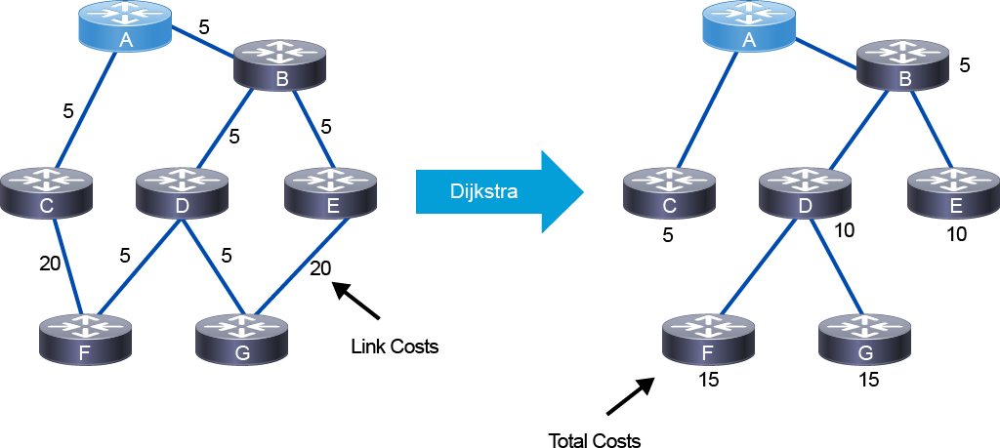
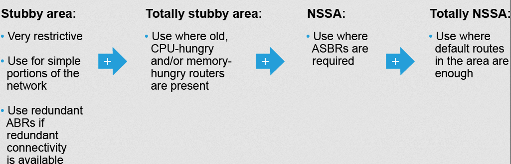

# OSPF

## OSPF Multiarea Overview

There are two types of areas within the area hierarchy of OSPF:

<ins>**Backbone area, transit area, or Area 0**</ins>: the central entity through which all areas must connect through to exchange routing updates. Usually end users are not connected to this.

<ins>**Regular area**</ins>: a.k.a. nonbackbone area. It will accept link updates, route summarizations, and external routes. Usually these are set up according to administrative or geographical groupings. 

### Multiarea advantages
- Minimizes routing table
- Localizes impact of topology changes (link flap)
- Detailed LSA flooding stops at area boundaries

### Considerations
- Potential less optimal forwarding due to loss of granular routing info, maybe.
- HA should be addressed at area border routes
- MPLS TE benefits from single area to ensure it can always pick best path

### Requirements for multiarea
- Area 0 is backbone, and all other areas must connect to it 
- All areas must be contiguous

### Guidelines
| Single Area | Multiple Areas |
| ----------- | ----------- |
| Provides optimal routing | Only use in large environments (100+ routers) |
| Simple implementation and maintenance | Use regular areas if possible | 
| Best suited for MPLS TE | Use stub and NSSA in case of old, CPU-hungry and/or memory-hungry routers | 
| -- | Ensure HA ABR's | 
| -- | Focus on addressing plan to enable effective summarization | 

##  OSPF Area and LSA Types

### Area types

- Backbone area 0 
- Regular area
- <ins>Stub area</ins>: does not accept route info that are external to the AS, such as non-OSPF sources redistributed. They use a default route to route outside the area. It cannot contain an ASBR unless the ABR is also a ASBR. 
- <ins>Totally Stubby</ins>: does not accept external or summary routes from other areas. They use a default route to route outside the area. It cannot contain ASBR unless the ABR is also a ASBR.
- <ins>NSSA</ins>: Similiar to stub area, except it allows for ASBR and uses special type 7 LSA for external routes inside NSSA area.
- <ins>Totally NSSA</ins>: Similiar to totally stubby, in that it does not accept external AS routes or summary routes, but it can contain ASBR and external LSA type 7 routes. Cisco proprietary.

### LSA types

- **LSA Type 1 - Router LSA** -- These exchange info about nodes within an area, and they do not leave the area. They are used to describe the state of router links.
    - In OSPFv3, router LSA's contain no address info. Instead, there is a new link LSA Type 8 that provides link-local and other addresses on a link for OSPFv3.
- **LSA Type 2 - Network LSA** -- Exchange info about multiaccess links within area, and they never leave the area. DR's generate these. Only flooded in the area that which they belong too.
    - In OSPFv3, network LSA's contain no address info. The new type 9 LSA intra-area-prefix LSA has route info.
- **LSA Type 3 - Summary LSA** -- ABR's generate summary LSA's based on type 1/2 LSA's, which are flooded into the backbone area to other ABR's. 
    - These are not flooded into totally stubby or totally NSSA areas.
- **LSA Type 4 - Summary ASBR LSA** -- ABR's generate summary advertisements that describe routes to ASBR's. The ASBR floods type 1's, which are converted to Type 4 by ABR's into backbone.
    - These are not flooded into totally stubby or totally NSSA areas.
- **LSA Type 5 - External LSA** -- ASBR generates AS external link advertisements. They describe routes to destinations external to the OSPF AS and are flooded only into backbone and regular areas (none of the stubs).
- **LSA Type 7 - NSSA LSA** -- used by NSSA areas for external routes. These are converted by ABR's into Type 5 when flooding into backbone.

## OSPFv2 Path Selection

### Overview
- OSPF path selection uses link costs as a metric and the Dijkstra algorithm to build the SPT based on lowest total costs
- Each link has an assigned cost, then that link is placed at the top of the tree, then the sum cost of links to the destination is calculated. 


### OSPF Metric
- By default, this is proportional to the bw of the link, but this is out of date given that Gigabit 1Gbps = cost 1. 
- General guidance is to set reference bw to higher value, like 400Gbps 
``` py title="both IOS XE and XR"
router# conf t
router(config)# router ospf 1
router(config-router)# auto-cost reference-bandwidth 400000

# bw in Mbps // 400000 == 400Gbps
```
- You can manually configure cost too
``` py title="IOS XE"
router# conf t
router(config)# router ospf 1
router(config-router)# ip ospf cost 4000
```
``` py title="IOS XR"
router# conf t
router(config)# router ospf 1
router(config-ospf)# area 0
router(config-ospf-ar)# int Gi0/0/0/1
router(config-ospf-ar-if)# cost 4000
```

### Path Selection Criteria
- It is important to remember cost is not the most preferred
- Select the path based on LSA preference
    1. Intra Area
    2. Inter Area
    3. External Type 1
    4. NSSA Type 1 
    5. External Type 2
    6. NSSA Type 2
- Then if there are multiple paths of the same type, evaluate one with the lowest cost

## OSPFv2 Summarization
- Summarization is the key to scaling OSPF. It saves you from a large routing table and frequent flooding throughout the backbone due to potential link flaps. A summary route can hold down (aka not flap) more specific prefixes inside the summary. 
- An ABR will automatically translate the Type 1 and Type 2 LSA's into their individual Type 3 Summary LSA's, and when enabled, they can summarize these into consolidated Type 3's. 
- A good addressing plan that lends itself to aggregation at the OSPF area borders is key!

### OSPF Interarea Route Summarization
- Only ABR's can summarize. Use `area 1 range` on IOS XE and `range` on IOS XR.
- Summary cost is equal to the minimum cost of a summarized prefix (RFC1583, default), or if enabled, the maximum cost based on RFC2328. `no compatible rfc1583`
- The ABR will generate a Null0 route for loopback protection

#### Configuration example on ABR between Area 0 and Area 1
``` py title="IOS XE"
router# conf t
router(config)# router ospf 1
router(config-router)# area 1 range 192.168.0.0 255.255.0.0
```
``` py title="IOS XR"
router# conf t
router(config)# router ospf 1
router(config-ospf)# area 1
router(config-ospf-ar)# range 192.168.0.0/16
```

### OSPF External Route Summarization
- Summarization of external routes can be done on the ASBR for type 5 LSAs (redistributed routes) before injecting them into the OSPF domain. Use `summary-address` on IOS XE and `summary-prefix` on IOS XR.
- `not-advertise` will filter out longer-prefixes within summary
- For NSSA areas, the ABR can summarize the Type 7 LSA's and associated external routes
- **NOTE** -- when redistributing on an ASBR, the imported prefixes will use subtype 2 (E2) by default. These have a "frozen" cost that will not increment cost based on link path when doing SPT. E1 subtype can be used for original external cost + total internal metric (per normal).

#### Configuration example for External Route Summarization
- This is on the *ASBR* at the external AS boundary where redistribution happens
``` py title="IOS XE"
router# conf t
router(config)# router ospf 1
router(config-router)# summary-address 10.10.0.0 255.255.0.0 not-advertise
```
``` py title="IOS XR"
router# conf t
router(config)# router ospf 1
router(config-ospf)# area 1
router(config-ospf-ar)# summary-prefix 10.10.0.0 255.255.0.0
```

## OSPF Special Areas
- Overall purpose is to inject a default route to reduce number of LSA's flooded into special area
- Stub areas are designed to reduce the amount of flooding, the LSDB size, and the routing table size in routers within the area
- They improve performance in OSPF networks and improve scalability

### OSPF Stubby Area
- Do not accept LSA's that are external to the AS, such as Type 5 LSA
- The Type 3 LSA allowed, and a default route injected as a Type 3. By default, the default route cost is 1. `area default-cost` to modify this. 
- ALL routers in the stub area must be configured with `stub` configuration, including the ABR

#### Configuration Examples - Stubby Area
``` py title="IOS XE"
router# conf t
router(config)# router ospf 1
router(config-router)# area 2 stub
```
``` py title="IOS XR"
router# conf t
router(config)# router ospf 1
router(config-ospf)# area 2
router(config-ospf-ar)# stub
```

### OSPF Totally Stubby Area
- Same as Stub area + filters ***ALL*** Type 3 LSA's. The only Type 3 allowed is the injected default route by ABR. 
- Cisco proprietary enhancement to further reduce the number of routes and LSA's
- Using totally stubby areas is typically a better solution than using stub areas

#### Configuration Examples - Totally Stubby Area
- Uses the addition of `no-summary` on area stub commands

``` py title="IOS XE"
router# conf t
router(config)# router ospf 1
router(config-router)# area 2 stub no-summary
```
``` py title="IOS XR"
router# conf t
router(config)# router ospf 1
router(config-ospf)# area 2
router(config-ospf-ar)# stub no-summary
```

### OSPF NSSA
- Same as a stub area, so Type 3 LSA's are allowed + a Type 3 with default route injected by ABR
- Defines a special type 7 LSA to allow for ASBR in a stub area for route redistribution
- At the ABR, the type 7 LSA is converted into a type 5 LSA
- In the case that the ABR is also the ASBR, type 7 LSAs *NOT* have the propagate-bit (P-bit) in the LSA header to prevent propagation loops between the NSSA and the backbone area. If the ASBR is not the ABR, the the P-bit will be set, and the ABR will know to convert to Type 5 and flood into backbone area.
- If there are multiple ABR's in NSSA, only the ABR with the highest Router ID will translate these Type 7's with P-bit
- In the routing table, Type 7 LSA's are shown as `O N2` by default, or if desired, they can be `O N1` like external type 1 with calculated total cost. 

#### Configuration Examples - NSSA
``` py title="IOS XE"
router# conf t
router(config)# router ospf 1
router(config-router)# area 2 nssa
```
``` py title="IOS XR"
router# conf t
router(config)# router ospf 1
router(config-ospf)# area 2
router(config-ospf-ar)# nssa
```

### OSPF Totally NSSA
- Same as NSSA combined with Totally Stubby to filter out Type 3 LSA's
- Cisco proprietary enhancement
``` py title="IOS XE"
router# conf t
router(config)# router ospf 1
router(config-router)# area 2 nssa no-summary
```
``` py title="IOS XR"
router# conf t
router(config)# router ospf 1
router(config-ospf)# area 2
router(config-ospf-ar)# nssa no-summary
```

### OSPF Area Design Guidelines
- Use a single area if possible
- Use regular areas if needed for scalability



## OSPFv2 Virtual Links
- Used in rare scenarios where an area is introduced that cannot have direct physical or logical access to the backbone area 0.
    - I.E. - M&A's or combining previous segmented networks

### Virtual Link Use Cases
- VL can be used to connect discontiguous backbone area 0's, and it can be used to connect another regular or stub area through a nonbackbone area to the backbone area 0.
- Relies on intra-area routing and stability of the underlying area. If you are connecting two area 0's together via a regular area that has poor stability, it could be a bad time.

### Virtual Link Characteristics
- the virtual link cost = total cost in path to destination
- serves as an extension of the backbone area 0
- cannot traverse stubby or NSSA areas!!
- also cannot traverse unnumbered links (?)
- the virtual link is treated as a direct connection between the ABR's of connected areas. Ideally you would use loopback interfaces as router ID to source the connectivity for the virtual links.

#### Configuration Examples - Virtual Links
``` py title="IOS XE"
router-abr2# conf t
router-abr2(config)# router ospf 1
router-abr2(config-router)# area 2 virtual-link 10.1.1.55
```
``` py title="IOS XR"
router-abr55# conf t
router-abr55(config)# router ospf 1
router-abr55(config-ospf)# area 2
router-abr55(config-ospf-ar)# virtual-link 10.1.1.2
```
### Virtual Link Guidelines
- Do not use these as a primary design tool
- A valid virtual link use case is where there is one physical link between two ABRs in the same area, and the link should be available to the backbone area and nonbackbone area.

## OSPF Fast Convergence
- By default, OSPF can take up to 40 seconds to converge upon a link or device failure.
    - Default hello timer = 10 seconds
    - Default dead timer = 40 seconds
- Cisco (and standards-based) techniques to improve convergence and OSPF stability:
    - Tune OSPF timers (hello/dead intervals, SPF, LSA)
    - Cisco Nonstop Forwarding (NSF)
    - Cisco Nonstop Routing (NSR)
    - Bidirectional Forwarding Detection (BFD) for OSPF

### Tuning OSPF Timers
- Lower timers can result in quicker detection and convergence time
- Configured at interface levels (and they must match to ensure stable adjacency between neighbors)
``` py title="IOS XE"
router# conf t
router(config)# interface gi1/2
router(config-if)# ip ospf hello-interval 5
router(config-if)# ip ospf dead-interval 15
# OR another dead-interval style conf
router(config-if)# ip ospf dead-interval minimal hello-multiplier 3
```
``` py title="IOS XR"
router# conf t
router(config)# router ospf 1
router(config-ospf)# area 2
router(config-ospf-ar)# interface gi0/0/1/5
router(config-ospf-ar-if)# hello-interval 5
router(config-ospf-ar-if)# dead-interval 15
```

### Cisco NSF and NSR
- Cisco NSF and Cisco NSR are two techniques that can provide stability to routing during route processor (RP) failures, restarts, switchovers, process restarts, and similar events in which the routing tables would be flushed due to loss of OSPF process.
- NSF allows data plane to continue forwarding during RP failover while the standby RP re-establishes OSPF database and state.
- Upon a RP failure, the NSF-capable router sends an OSPF Cisco NSF signal to neighboring NSF-aware devices to not reset adjacency in the form of a link-local LSA (type 8?). The NSF-cabable (failed over device) rebuilds neighbor list based on this LSA and response.
- It rebuilds neighbor list and then resyncs the LSDB with all NSF-aware neighbors to remove stale entries and update RIB and FIB. 

- Cisco NSR allows RP failures, process restarts, and in-service upgrades to be invisible to peers. If available, makes it easier to utilize NSF and IETF graceful restart protocol extensions

### Bidirectional Forwarding Detection (BFD)
- BFD provides a low-overhead, short-duration method of detecting failures in the forwarding path between two adjacent routers, including the interfaces, data links, and forwarding planes
- Async mode is supported, so after it is configured, a session is created, timers are negotiated, and peers send BFD control plane packets at negotiated interval.
- No neighbor discovery process-- configured on both sides.
- BFD relies on control packets or echo packets
    - They are IP packets addressed to the sending router itself but forwarded to the L2 address of the next-hop node. When the neighboring router receives this packet, it performs a L3 lookup (based on IP dst address) and sends the packet back to the final destination (the originating router)

#### Configuring BFD for OSPF
``` py title="IOS XE"
router# conf t
router(config)# interface gi1/2
router(config-if)# bfd interval 50 min_rx 50 multiplier 5
router(config-if)# ip ospf bfd
# OR 
router(config-if)# bfd all-interfaces
```
``` py title="IOS XR"
router# conf t
router(config)# router ospf 1
router(config-ospf)# bfd minimum-interval 50
router(config-ospf)# bfd multiplier 5
router(config-ospf)# area 1
router(config-ospf-ar)# interface gi0/0/1/5
router(config-ospf-ar-if)# bfd fast-detect
```

## OSPF for IPv6 
- OSPFv3 is a multiprotocol implementation of OSPF that supports IPv6 in addition to IPv4
- Router-id is no longer based on IPv4 address, it is configured in the routing process and is still a 32-bit number that is used to sign routing updates
- OSPFv3 adfancies and next-hop attributes use link-local addresses
- IPv6 is used to transport LSA's
- Only enabled per-link, not per-network
- Router ID, area ID, and link-state ID remain 32 bits (not from an IPv4 address)
- LSA's have a flooding scope based on a radius:
    - link-local
    - area
    - AS
    - handling and forwarding of unknown LSA's is supported
- Uses link-local multicast addresses:
    - FF02::5 for OSPF routers
    - FF02::6 for OSPF DR's

### Different or renamed LSA's
**Interarea-prefix LSA for ABRs (Type 3)** -- advertises internal networks to routers in other areas. Prefix length is used instead of subnet mask. Default route is a /0 prefix length.

**Interarea LSA for ASBR (Type 4)** -- advertses the location of an ASBR. Routers trying to reach an external network use these to determine the best path to the next hop. ABR's generate these on behalf of ASBR.

### New LSA's
**Link LSA (Type 8)** -- *(replaces Type 1)* Link-local flooding scope. They are not flooded beyond the link with which they are associated. They provide a link-local address of router to all other routers on the link, informing others attached on that local link of prefixes associated with the link, and also allows the originating router to asset a collection of option bits with that network LSA that will be originated for the link.

**Intra-area-prefix LSA (Type 9)** -- *(replaces Type 2)* a router can originate LSA type 9's for each router or transit network with unique link-state ID's. The link-state ID describes its association to either a router or network LSA and contains prefixes for stub or transit networks.

### Configuring OSPFv3
- A routing process is not explicitly required, just enable an interface and it will cause a routing process to be created.

``` py title="IOS XE"
# IPv6 addressing is implied
router# conf t
router(config)# interface gi1/2
router(config-if)# ipv6 ospf 1 area 0
router(config)# ipv6 router ospf 1
router(config-router)# area 2 range 2001:db9:1::/48
```
``` py title="IOS XR"
router# conf t
router(config)# router ospfv3 1
router(config-ospf)# area 0 
router(config-ospf-ar)# int gi0/0/1/5
```

- For IOS XR, both inter-area route summarization uses the `range` config, and `summary-prefix` for external route summarization on ASBR (upon redistribution into OSPF from external AS)

## Troubleshooting OSPF

- Understanding the requirements and limitations of OSPF is critical to troubleshooting
- OSPF neighborships/adjacency requires these to align:
    - <ins>area id</ins>: the areas configured on interfaces
    - <ins>hello and dead intervals</ins>: must/should match. If not, then possibly if no hellos within the dead interval, then neighbor is declared dead
    - <ins>subnet mask</ins>: must match; although not requirement for p2p links
    - <ins>authentication key</ins>: must match, if not there is no adjacency
    - <ins>network type</ins>: p2p or other, must match so DR/BDR election can take place
    - <ins>stub flag</ins>: routers must use the same flag
    - <ins>MTU</ins>: LSA's can or will be dropped if there is a mismatch 

### Troubleshooting Incomplete OSPF Adjacency
- Final OSPF state is Full after routing tables are synced.
- [Cisco.com OSPF Neighbor States](https://www.cisco.com/c/en/us/support/docs/ip/open-shortest-path-first-ospf/13685-13.html#toc-hId--671632336)
- On a multiaccess network, a router will stay in 2-way state with non-DR/BDR neighbors

**Common Issues in each state**:

- DOWN state or there is no state
    - OSPF process has not received any hellos packets from neighbor
    - Things to look at:
        1. Check cabling, check ACL's or firewalls to verify forwarding and tx/rx between neighbors
        2. Verify OSPF is enabled -- `show ip ospf int`
        3. Verify that OSPF is not passive on interface
        4. Check that the router ID is different on both sides
        5. Validate the required parameters
- INIT State
    - Router has received a hello packet from neighbor, but it does not yet see its own router ID in the hello packet from neighbor
    - Things to look at:
        1. Verify ACL's or firewalls to verify forwarding and tx/rx between neighbors
        2. Check there are no layer 2 problems between neighbors
        3. Verify authentication matches on both sides if using
- EXSTART, Exchange
    - The Database Description (DBD) and LSA packet exchange were not successful after DR, BDR election
    - Check MTU or if NAT is being used to translate OSPF packets
    - Check for possible interoperability issues if neighbor is another vendor 
    - Verify the router ID's are different

### OSPF Route Exchange Troubleshooting between Areas
- If there is a discontiguous area 0 or another area is seperated from area 0, then there will be route exchange issues since all areas rely on area 0 to exchange routing information
- If there is inconsistent routing, validate that:
    - OSPF interfaces are in the correct and intended area
    - Check ABR's - `show ospf border-routers`
    - Validate there is no route-map or route-policy filtering inbound routes