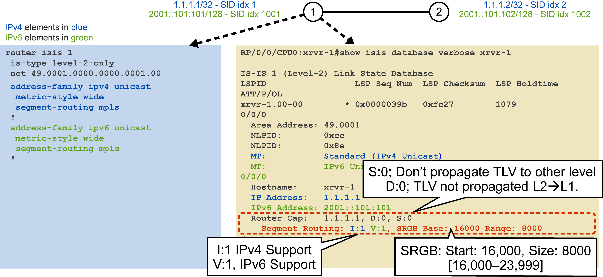
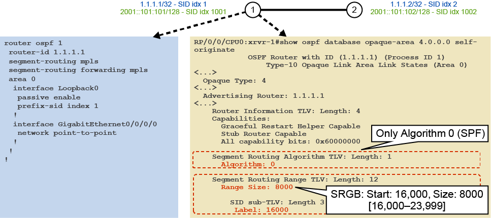
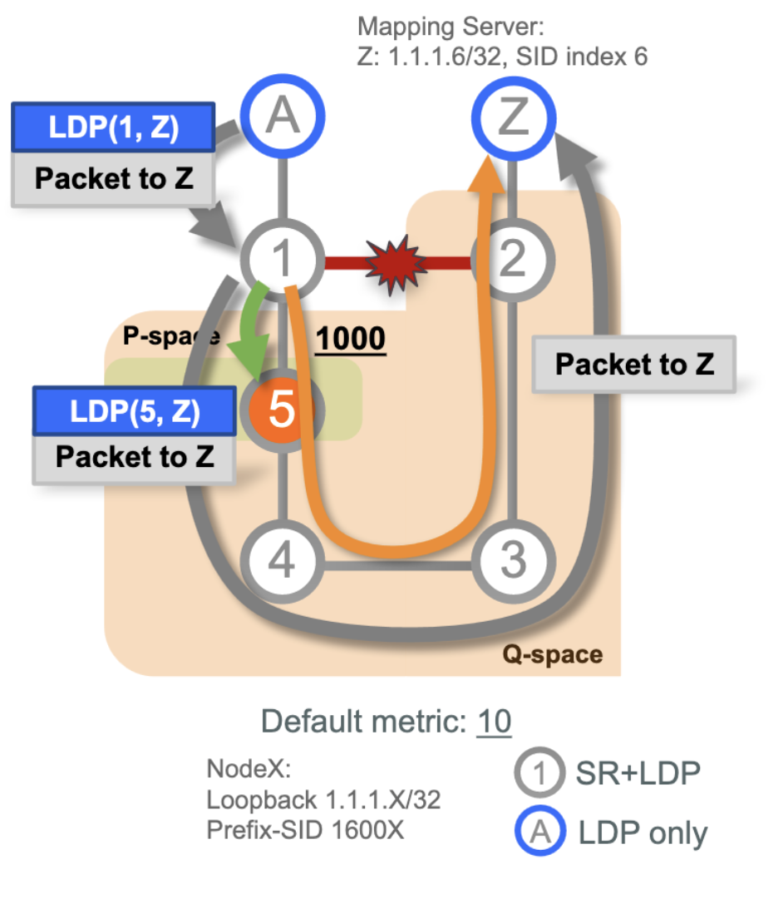

# Segment Routing

## Segment routing and IGPs

Segment Routing (SR) is a flexible, scalable way of doing source routing. The source chooses a path and encodes it in the packet header as an ordered list of segments. Segments are identifier for any type of instruction. Each segment is identified by the segment ID (SID) consisting of a flat unsigned 32-bit integer. Segment instruction can be:

- Go to node N using the shortest path

- Go to node N over the shortest path to node M and then follow links Layer 1, Layer 2, and Layer 3

- Apply service S

Segment routing is a more simple approach, probably. Instead of using LDP to pass MPLS labels and segments, we can use extensions to IS-IS and OSPF. 

### IS-IS modifications

TLV extensions to support prefix segment identifiers (SID's), adjacency SID's, and prefix-to-SID mapping advertisement. 

IS-IS has the following segment routing functionality:

- IPv4, IPv6 control plane
- Level 1, Level 2, and multilevel routing
- Prefix SIDs for host prefixes on loopback interfaces
- Adjacency SIDs for adjacencies
    - Nonprotected and protected SIDs
- Prefix-to-SID mapping advertisement (mapping server)
- MPLS penultimate hop popping (PHP) and explicit-null signaling

### OSPF modifications

OSPF extensions have been added in order to provide the necessary support for segment routing, including prefix segment identifiers, adjacency segment identifiers, and prefix-to-SID mapping advertisements.

OSPF segment routing functionality extensions:

- OSPFv2 control plane
- OSPF extensions
- Multi-area
- IPv4 prefix segment ID (prefix SID) for host prefixes on loopback interfaces
- Adjancency segment (adj-SID) for adjancencies, nonprotected and protected adj-SIDs
- MPLS PHP and explicit-null signaling

OSPF adds to the Router Information Opaque LSA type 4-- SR-algo TLV (8) and SID/Label range TLV (9).

Also, it defines new OSPFv2 Extended Prefix Opaque LSA type 7 and Extended Link Opaque LSA type 8.


## Segment Routing Labels

Segment Routing Global Block (SRGB) is the range of labels reserved for SR Global Segments in the Label Information Database (LIB) or Label Switching Database (LSD). These values are assigned as SIDs to SR-enabled nodes. On SR-capable routers, SRGB is enabled by default so that label values are auto-reserved when the router boots, whether or not it is used/enabeld.

By default, this is 16000-24999. 

Segment Routing Local Block (SRLB) is a range of label values preserved for the manual allocation of adjacency segment identifities (adj-SIDs). These are locally significant, only valid on the local node 15000-15999.

A prefix-SID is advertised as a domain-wide unique index, which then refers to a unique label within the SRGB.

- Index is zero based, i.e. first index = 0
– Label = Prefix-SID index + SRGB base
– E.g. Prefix 1.1.1.65/32 with prefix-SID index 65 gets label 16065


### IS-IS and the SRGB

- The SRGB is advertised via IS-IS Router Capabilities TLV
    - Contains the router-ID, flags (Scope (`S`) indicates flood TLV across routing domain, Down (`D`) if TLV is leaked from L2 to L1), then optional sub-TLV's
- SR Capabilities sub-TLV is included in the Router Capabilities TLV
- SR Capabilities sub-TLV contains flags and one or more SRGB descriptors
    - Then... SRGB descriptor contains the range, and the SID/label, indicating a start of SRGB
    - SR-Capabilities sub-TLV *flags* could be `I` for outoing IPv4 encapsulation or `V` for outgoing IPv6 encap.




### OSPF and SRGB in LSAs

The OSPF Router Information Opaque LSA carries information about the SRGB, including the range, size, and start of the SRGB:

- the SRGB descriptors is included in the Router Info Opaque LSA type 4 LSA
    - the SR algorithm TLV (8), which will be `algo 0: Shortest Path First (SFP)` based on link metric
    - the SID/label range TLV (9)




## SR IS-IS Configuration

SR with IS-IS is enabled per address-family, and it will be enabled on all nonpassive IS-IS interfaces. 

Adjacency SIDs are allocated and distributed for all adjacencies for both nonprotected adjacency SIDs and protected adjacency SIDs, using Segment Routing Traffic Engineering (SR-TE).

``` py title="IOS XR"
!
router isis 1
  address-family ipv4 unicast
    metric-style wide
    segment-routing mpls
  !
    address-family ipv6 unicast
    metric-style wide
    segment-routing mpls
  !
  interface Loopback0
    passive
    address-family ipv4 unicast
      prefix-sid absolute 16001
    !
    address-family ipv6 unicast
      prefix-sid absolute 20001
  !
  interface TenGigE0/2/0
    point-to-point
    address-family ipv4 unicast
    !
    address-family ipv6 unicast
```

- A prefix segment identifier (SID) is associated with an IP prefix. 
- The prefix SID is manually configured from the segment routing global block (SRGB) range of labels. 
- A prefix SID is configured under the loopback interface with the loopback address of the node as the prefix. 
- The prefix segment steers the traffic along the shortest path to its destination. 

- An adjacency SID (Adj-SID) is associated with an adjacency to a neighboring node. 
- The adjacency SID steers the traffic to a specific adjacency. 
- Adjacency SIDs have local significance and are only valid on the node that allocates them. 

To **verify IS-IS capabilities**, you can use a few commands...

`show isis database verbose` to examine the IS-IS link-state database to look at SR descriptors for propagated info.

- Further in this command, you can look at the prefix-SID advertisements which are via the IPv(4|6) reachability TLV


`show isis database verbose` will show LAN-adjacency label advertisements, then you can look at the local label value (the LAN-ADJ-SID), such as 24001, which is allocated dynamically by default from the SRLB.

- If you were to look at `show mpls forwarding`, the local label would correspond to the LAN-AJD-SID.

## SR OSPF Configuration

If OSPF is enabled for SR, it will be enabled on all interfaces also enabled for OSPF. Then Adjacency-SIDs will be allocated and distributed for SR-enabled adjacencies.

``` py title="IOS XR"
!
router ospf 1
  segment-routing mpls
  segment-routing forwarding mpls
  router-id 1.1.1.1
  area 0
    interface Loopback0
      passive enable
      prefix-sid absolute 16001
    !
    interface GigE0/0/0/0
      network point-to-point
    interface GigE0/0/1/1

!
```

- OSPF supports a hierarchical model: Instance>Area>Interface
    - If enabled at a higher level, inherited down

``` py title="IOS XR"
!
router ospf 1
  area 0
    segment-routing mpls
    segment-routing forwarding mpls
    interface GigE0/0
      segment-routing forwarding disable
!
```


To **verify OSPF SR capabilities**, `show ospf database` is used and `self-originate originate` option is helpful


Then you'd want to narrow down on specific Type 4 LSA, like `show ospf database opaque-area 4.0.0.0 self-originate`, which will show the SR TLV's with capabilities information, like SRGB range, algo.

We can look more closely at Type 7 LSA, like `show ospf database opaque-area 7.0.0.1 self-originate`, to examine prefix-sid advertisements or for Type 8 LSA, like `show ospf database opaque-area 8.0.0.4 self-originate` to see Adj-sid and TLV's. Including the `Label`

- OSPF allocates an adjacency SID for each adjacency in the 2WAY state or higher.
- On a broadcast or NMBA network, a node advertises an `Adj-SID` by using the `Adj-SID sub-TLV` for its adjacency to the **DR** and advertises `Adj-SIDs` by using the `LAN Adj-SID` for other neighbors such as **BDR** and **DR-OTHER** on the network.

`show ip ospf neigh [4.4.4.4] detail` can show the Adj SID label too.

## SR BGP Configuration

If you want to use Border Gateway Protocol (BGP) with segment routing, you need to understand the changes to BGP and how to configure BGP for segment routing.

The BGP prefix label index is an optional transitive BGP path attribute.

The following example shows how to configure the SRGB, create a BGP route policy using a $SID parameter and set label-index attribute, and then associate the prefix-SID index to the node.

``` py title="IOS XR"
RP/0/RSP0/CPU0:router(config)# segment-routing global-block 16000 23999

RP/0/RSP0/CPU0:router(config)# route-policy SID($SID)
RP/0/RSP0/CPU0:router(config-rpl)# set label-index $SID
RP/0/RSP0/CPU0:router(config-rpl)# end policy

RP/0/RSP0/CPU0:router(config)# router bgp 1
RP/0/RSP0/CPU0:router(config-bgp)# bgp router-id 10.1.1.1
RP/0/RSP0/CPU0:router(config-bgp)# address-family ipv4 unicast
RP/0/RSP0/CPU0:router(config-bgp-af)# network 10.1.1.3/32 route-policy SID(3)
RP/0/RSP0/CPU0:router(config-bgp-af)# allocate-label all
RP/0/RSP0/CPU0:router(config-bgp-af)# commit
RP/0/RSP0/CPU0:router(config-bgp-af)# end

RP/0/RSP0/CPU0:router-NEIGHBOR# show bgp 10.1.1.3/32
BGP routing table entry for 10.1.1.3/32
Versions:
  Process           bRIB/RIB  SendTblVer
  Speaker                 74          74
    Local Label: 16003
Last Modified: Sep 29 19:52:18.155 for 00:07:22
Paths: (1 available, best #1)
  Advertised to update-groups (with more than one peer):
    0.2 
  Path #1: Received by speaker 0
  Advertised to update-groups (with more than one peer):
    0.2 
  3
    99.3.21.3 from 99.3.21.3 (10.1.1.3)
      Received Label 3
      Origin IGP, metric 0, localpref 100, valid, external, best, group-best
      Received Path ID 0, Local Path ID 1, version 74
      Origin-AS validity: not-found
      Label Index: 3
```

In this `show bgp` output above, we see the `Label Index` and `Received Label` are the same, indicating ImplNull label, indicating PHP.

`show cef` will show locally assigned labels as well as labels swapped onto packet. In the `labels imposed` (swapped onto), there will be label to next-hop and BGP prefix-SID label. 

`show mpls forwarding` to look at the data plane

```
RP/0/RSP0/CPU0:router_C# show mpls forwarding labels 24002 24003
Local  Outgoing    Prefix             Outgoing     Next Hop        Bytes       
Label  Label       or ID              Interface                    Switched    
------ ----------- ------------------ ------------ --------------- ------------
24002  Pop         No ID              Te0/3/0/0    192.168.1.2     0 
24003  Pop         No ID              Te0/1/0/0    192.168.1.3     0  
```


## SR and LDP Interworking Concepts 

A.k.a, the migration.

The MPLS architecture permits the concurrent use of LDP, Resource Reservation Protocol-Traffic Engineering (RSVP-TE), and segment routing. The label manager (Label Switching Database (LSD)) on the node ensures that the labels used by various label protocols dose not collide and that local labels are uniquely allocated and assigned.

For the global segments, it is the operator's responsibility to ensure that each global segment is unique within the segment routing domain.

MPLS - MPLS or MPLS - IP works fine, labels are unique within their own scope. 

However, there can be issues for multiple IP-to-MPLS entries (SR and LDP), which cannot coexist equally.

`segment-routing mpls sr-prefer` or (default) `segment-routing mpls` (*LDP*)


### IGP, SR, LDP Programming FIB

The IGP has its own database (containing SR descriptors), which is installed into the RIB. 

So for example, we have prefix lookup on 10.100.200.3/24, which is `Loc_label 16005` and `Out_label 16005` in the IGP. This is pushed to the RIB.

The RIB forwards this to LDP/LSD, which provides LDP labels `Loc_label 24005` and `Out_label 24006` and sends to the FIB.

The RIB also forwards the IGB prefix path and IGP-provided SR labels to the FIB.

By default, the FIB will prefer LDP-based label imposition, so the LDP labels are installed in cef.

### Migration methods

A **simultaneous deployment model** can be used as a step in the simple migration from LDP to segment routing.

1. Upgrade all nodes to support SR, then leave default LDP label imposition preference
2. PE routers re-configured to prefer SR label imposition `segment-routing mpls sr-prefer`
3. LDP is removed from nodes in the network

?? Probably others -- explore more since test says "Migration procedures (SR prefer and mapping server)"

## SR Mapping Server Function and Config

The mapping server advertises prefix-to-prefix-SID mappings on behalf of non-SR capable nodes. This action is necessary to enable interworking between SR and non-SR (LDP only) nodes.

A router must be able to act as a mapping server, a mapping client, or both. 

At steady state, all routers, at least in the same area or level, must have identical active mapping policies.

**Mapping Server** functionality:

- Advertise prefix-to-SID mappings in IGP to non-SR capable nodes
- Prefix-to-SID mappings are configured on the mapper server
- Enable SR-capable nodes to interwork w/ LDP nodes

Similiar to a **Route Reflector**:

- Control plane mechanism
- Does not have to be in the data plane
- Must be resilient and redundancy should be provided

The **Mapping Client** functions:

- Receive and parse prefix-to-SID mappings from server(s)
- Use remotely learned and locally configured mappings for a valid and consistent active SID mapping policy.
- Mappings not selected for active policy go to backup policy.
- By default, mapping client functionality is enabled. 

Prefix SIDs received from a mapping server have an implicit PHP-off behavior: The penultimate hop does not pop the prefix SID label.

Packets arrive at the destination with prefix SID label on top...

- Packet with local prefix SID as top label would require two label lookups at the receiving node to forward packet: top-label lookup, pop top-label, next-label, or address lookup performance impact.
- In Cisco IOS XR Software, no MPLS forwarding entry is installed for local prefix SIDs. Packets with local prefix-SID as top label are dropped. 


### Configuring Mapping Server

``` py title="IOS XR"
RP/0/RSP0/CPU0:router(config)# segment-routing
RP/0/RSP0/CPU0:router(config-sr)# mapping-server
RP/0/RSP0/CPU0:router(config-sr-ms)# prefix-sid-map
RP/0/RSP0/CPU0:router(config-sr-ms-map)# address-family ipv4|ipv6

# ip-address/ prefix-length first-SID-value range range 
RP/0/RSP0/CPU0:router(config-sr-ms-map-af)# 10.1.1.1/32 10 range 200 
```
Prefix 10.1.1.1/32 is assigned prefix-SID 10, prefix 10.1.1.2/32 is assigned prefix-SID 11,…, prefix 10.1.1.199/32 is assigned prefix-SID 200 

On the **mapping server**, to verify locally configured-- 
`show segment-routing mapping-server prefix-sid-map [ipv4 | ipv6] [detail]`

You must additionally do some sort of **routing protocol** IGP configuration too...

``` py title="IOS XR"
!
router isis 1
  address family ipv4|ipv6 unicast
    segment-routing prefix-sid-map advertise-local


!
router ospf 1
  segment-routing prefix-sid-map advertise-local
```

If the mapping server is a Level 1 or Level 2 router in IS-IS or an Area Border Router (ABR) in OSPF, the mappings will be advertised in all levels or areas of the IGP instance.

On mapping clients, the default behavior is `segment-routing prefix-sid-map receive`, you can configure both or only `advertise-local`. A common sense design is like Route Reflectors, each node should be a mapping client to receive the prefix-to-SID mappings that it would not otherwise receive through the link-state advertisement from the non-SR nodes.


## TI-LFA for SR

Topology Independent Loop-Free Alternate (TI-LFA)

This is a fast reroute feature, that precomputes a backup path via the IGP. TI-LFA composes the list of segments necessary to steer the traffic a the backup path along the post-convergence path.

The post-convergence path is the path that will be used after IGP has converged following a failure.

This was not possible pre-SR, since SR enforces the post-convergence path as a list of segments. 

Uses existing and proven LFA technology and terminology (mostly my own words here, RFC7490 too)

- protected link L is more or less than current shortest path or "best link vulnerable to failure"
- P space is set of nodes reachable (using pre-convergence paths) from node S without using protected link L
    - there will be a "point on the network" that will be "beyond the horizon" aka never utilized due to the Shortest Path Tree between S and D because the protected link will always be Shortest Path to get "over the horizon". 
- Q space is a set of nodes that can reach (using pre-convergence paths) destination D without using protected link L
    - the "other side of the horizon"
- P node: any node that is only in P space.
- Q node: any node that is only in Q space.
- PQ node: a node that is a member of both the extended P-space and the Q-space.


Generalizes the name of nodes on the backup path:

– P-node: node reached via a Prefix-SID
– Q-node: node reached via an Adj-SID

### Configuring TI-LFA

IS-IS configuration is per interface, and both commands are required for TI

``` py title="IOS XR"
router isis 1
  interface Gi0/0/0/2
    address family ipv4|ipv6 unicast
      fast-reroute per-prefix
      fast-reroute per-prefix ti-lfa
```

OSPF configuration can utilize OSPF inheritance (instance>area>interface).

``` py title="IOS XR"
router ospf 1
  fast-reroute per-prefix
  fast-reroute per-prefix ti-lfa
```

In a `zero-segment` backup path, the Source node sends packet to alternative node without any additional segment. Since once alternative node receives the packet (and flow), it can forward to the destination with already tagged prefix-SID label. 

<figure markdown="span">
  { width="450" }
  <figcaption></figcaption>
</figure>

In a `single-segment` backup path, the Source node sends the packet to alternative node with an additional segment to enable the next node to push the segment to the next next node can forward to destination with existing prefix-SID label.

When looking at `show isis ipv4 fast-reroute x.x.x.x/32 detail`, you'll see the label stack showing original destination prefix-SID label + single segment label.

For OSPF with `show ospf 1 routes x.x.x.x/32 backup-path`, you see the "two-hop" P-node (R4 in example screenshot) and associated label.

<figure markdown="span">
  { width="450" }
  <figcaption></figcaption>
</figure>

In `double-segment` backup path, the Source node sends the packet to alternative node with 2 additional segments to enable final P node to forward packets into Q space with existing prefix-SID labels.

When looking at `show ospf 1 routes x.x.x.x/32 backup-path`, it will show both P and Q node router-ID's with their associated labels, aka double-segment. 

<figure markdown="span">
  { width="450" }
  <figcaption></figcaption>
</figure>

## SR TI-LFA for LDP

SR and TI-LFA can be incrementally deployed, and in the areas where they are deployed, they provide guaranteed protection also for LDP traffic. 

TI-LFA protection uses the SR/LDP interworking functionality.

- FIB uses label merging functionality for backup path
- Using LDP labels instead of SR labels where possible

The mapping server advertises prefix-to-SID mappings for prefixes without prefix SID that must be protected (*as show in screenshot below at the top*).

<figure markdown="span">
  { width="450" }
  <figcaption></figcaption>
</figure>

When looking at `show mpls ldp bindings $destination_Z`, you'll see 2 destination labels. Then you can easily look at `show cef $dest_Z` to identify which is backup and protected.

This example is from a LDP-only source to a LDP-only destination.

Here is a good screenshot example from Cisco's segment-routing presentation:

<figure markdown="span">
  { width="750" }
  <figcaption></figcaption>
</figure>

For double-segment TI-LFA with LDP, the adj-SID will be used to steer packet into Q space. 


Protecting LDP traffic with TI-LFA – Restrictions

- Point of Local Repair (PLR) must be SR-capable
- Protected destination must have an associated prefix-SID
    – Advertised by itself if SR-capable
    – Advertised by mapping server if not SR-capable
- Single-segment protection: PQ node must be SR-capable
    - If not, use rLFA, which requires targeted LDP session
- Double-segment protection: P and Q nodes must both be SR-capable


##  TI-LFA and SR LDP Interworking

TI-LFA leverages SR/LDP interworking functionality if not all nodes on the backup path are SR enabled. 

The main characteristics of this is:

- LDP traffic is protected by TI-LFA
- When protecting LDP with TI-LFA, the backup path for LDP MPLS-to-MPLS uses LDP labels if they are available:
    - Not configurable via SR/LDP preference, like `sr-prefer`
    - LDP label can be available to reach P, PQ node
    - LDP label can be available to reach destination D from PQ
- When protecting SR w/TI-LFA, the backup path for SR MPLS-to-MPLS uses SR labels if the next hops is SR-capable.
    - P, Q, and PQ must be SR-capable and must advertise a prefix SID
    - Destination must have a prefix SID
- Labels in backup for IP-to-MPLS depend on **configured** LDP/SR preference (`sr-prefer`)

<figure markdown="span">
  { width="450" }
  <figcaption></figcaption>
</figure>

So in our screenshot above, when on the PLR (node 1), we can examine the labels and backup paths with our previously used show commands like

`show isis fast-reroute 1.1.1.6/32` - we'd see IS-IS has no outgoing label for router 5. There is no segment instructions, but we will see the 16006 label for the prefix-SID 1.1.1.6/32

- IS-IS cannot provide an outgoing label for Node4 since the downstream neighbor Node5 **is not SR enabled**
- SR/LDP interworking will replace this missing label with the corresponding LDP label... which we can observe in `show mpls ldp bindings 1.1.1.6/32` the remote bindings for Node4. 
- Then in `show cef 1.1.1.6/32`, we can see the label stack with `labels imposed [LDP interworked label] [SR prefix-SID label]`


The process for which TI-LFA and SR LDP interworking happens is... complex

- IF a PLR has LDP enabled and TI-LFA has a calc'd PQ node for backup, PLR sends targeted LDP hellos to that PQ.
- If PQ accepts the tLDP hellos, an LDP session is established between PLR and PQ
- If a PLR receives an LDP label for `$dest_prefix` from the PQ, it uses that label in backup path for *LDP traffic*
- SR/LDP inteworking mechanism works for all labels on the TI-LFA backup path:
    - if LDP sends an unlabeled entry to LSD and then IGP sends a valid label for the same entry to RIB, the valid IGB (SR) label is used in FIB
    - if IGP sends an unlabeled entry to RIB and LDP sends a valid label for same entry to LSD, the valid LDP label is used in the FIB


## SR in v6 Overview

SR in IPv6 environments can also use the IPv6 data plane for source routing in addition to the MPLS data plane. SRv6 can be a gradual migration with full backwards compatability. It can be IPv6 control + (MPLS or IPv6 data plane).

SR-IPv6 allows IPv6 data plane networks to benefit from all features deployed over the years in MPLS networks:

- Traffic engineering
- VPNs
- Fast Reroute

SR-IPv6 also enables a number of new features:

- Conduit
- Service chaining
- BGP traffic engineering
- BGP peer engineering
- Application engineered routing

For SRv6, only the nodes that have to process the packet header must have SR-IPv6 data plane support. All other nodes are just plain IPv6 nodes. SRv6 uses RFC 2460 (redefined more or less in RFC8986 too) uses a new type of header called Segment Routing Heading (SRH).

In the SRH and the IPv6 packet, there are several critical fields to know:

**Next header**: an 8-bit field that indicates what the type of header immediately following the SRH. 

**Hdr Ext Len**: 8-bit unsigned integer. Defines the length of the SRH header in 8-octet units, not including the first 8 octets.

**Type**: 4

**Segments Left**: index, in the Segment List, of the current active segment in the SRH. Decremented at each segment endpoint. It is a list of 128-bit IPv6 addresses representing each segment of the path. The Segment List is encoded in the reverse order of the path: the last segment is in the first position of the list and the first segment is in the last position.

**First Segment**: offset in the SRH, not including the first 8 octets and expressed in 16-octet units, pointing to the last element of the Segment List, that is if that contains the first segment of the path.

**Flags**: 16 bits of flags. These flags are defined:

- bit-0: cleanup
- bit-1: rerouted packet

## SR Header Procedures

SRH behavior and processing depends on the type and capability of node:

- Source node
- Transit node:
    - Intrasegment transit node
    - Non-SR intrasegment transit node
    - Segment endpoint node

**Source Node** characteristics... a SRH is created with a `Segment List` encoded in reverse order of the path. `Segments Left` is set to `n`-1 where `n` = number of segments in segment link. Then `First Segment` field is n-1.

- The Destination Address (DA) of the packet is set as the first segment of the path (DA = Segment_List[Segments_Left])
- Then the packet is sent out to the first segment, aka, the DA. 

**Non-SR transit nodes** will use plain IPv6 forwarding, solely on IPv6 DA. Transparent and interoperable with legacy non-SR-capable nodes.


### Insertion vs. Encapsulation

Header insertion at the source. 

- Source originates the packet with SRH
- SRH is kept and used along the path, finally delivered to DA
- OR, optionally, the SRH may be removed prior to deliver 

Compare to header insertion at ingress:

- Source originates the packet without any SRH.
- SRH is inserted at ingress.
- SRH is removed prior to deliver the packet to the destination.

And also compare to encapsulation at ingress:

- Source originates packet without any SRH
- Ingress encaps incoming packet into new outer IPv6 header + SRH
- Upon leaving SR domain, decap'd without outer SR header + SRH

